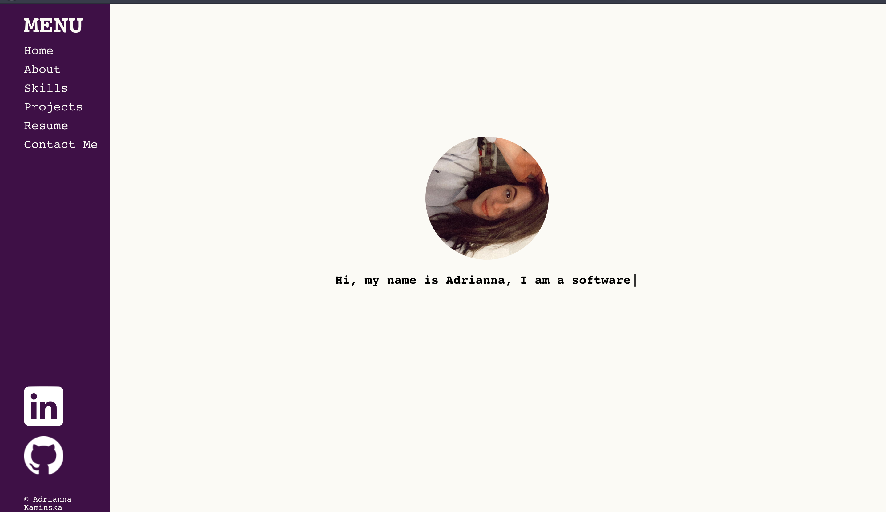
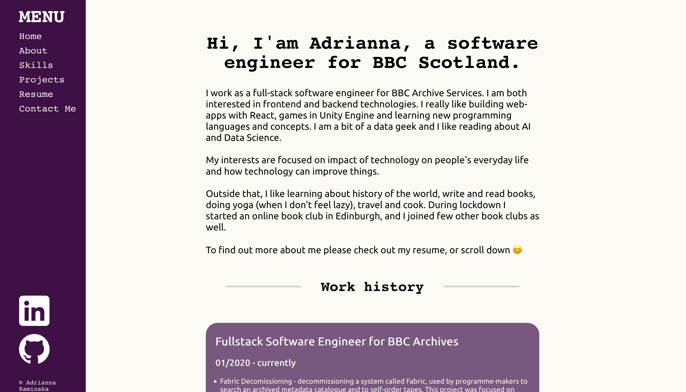
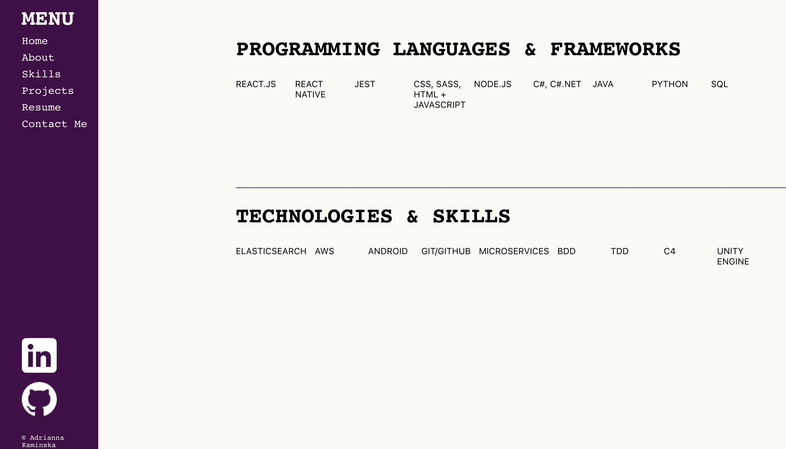
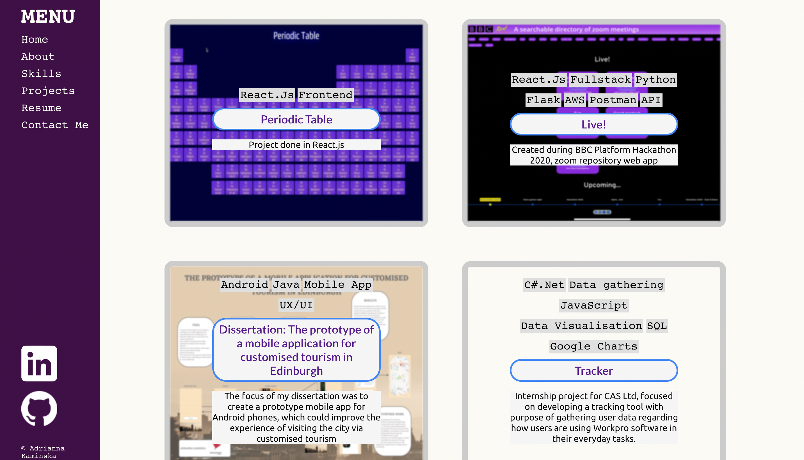

# minimalistic

## My portfolio 
Since I consider myself to be React developer (at least to certain degree) I decided to create portfolio in React.JS. 
Because at the moment I have a job, this portfolio is more for exercise purposes and to keep in one my places my favourite projects together (although I hope that in close future I will be able to have more interesting projects to show off). 

Here are some screenshots of how portfolio looks like: 

I think regarding the overall aesthetics I could a bit more input to it, but during lockdown my creativity levels are shamefully low. 

Useful for deploying react app in github pages: https://dev.to/yuribenjamin/how-to-deploy-react-app-in-github-pages-2a1f